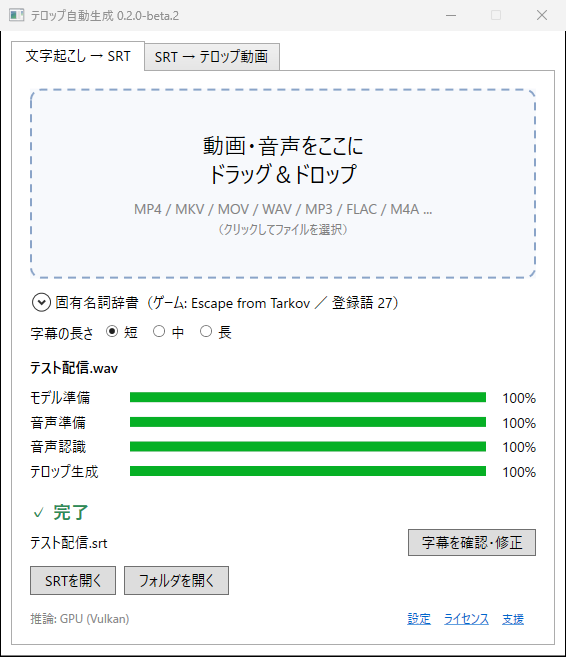
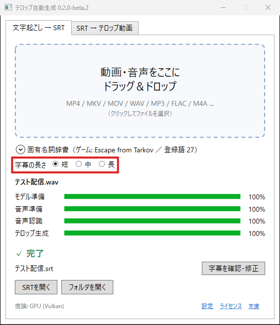
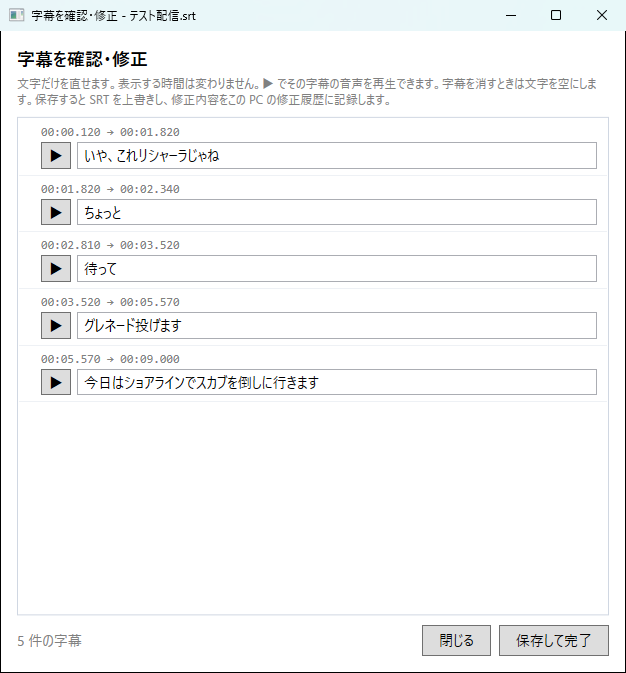
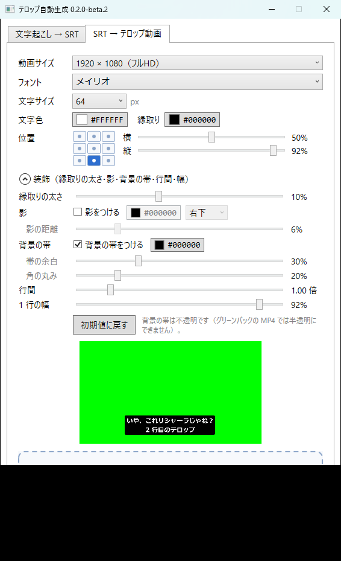
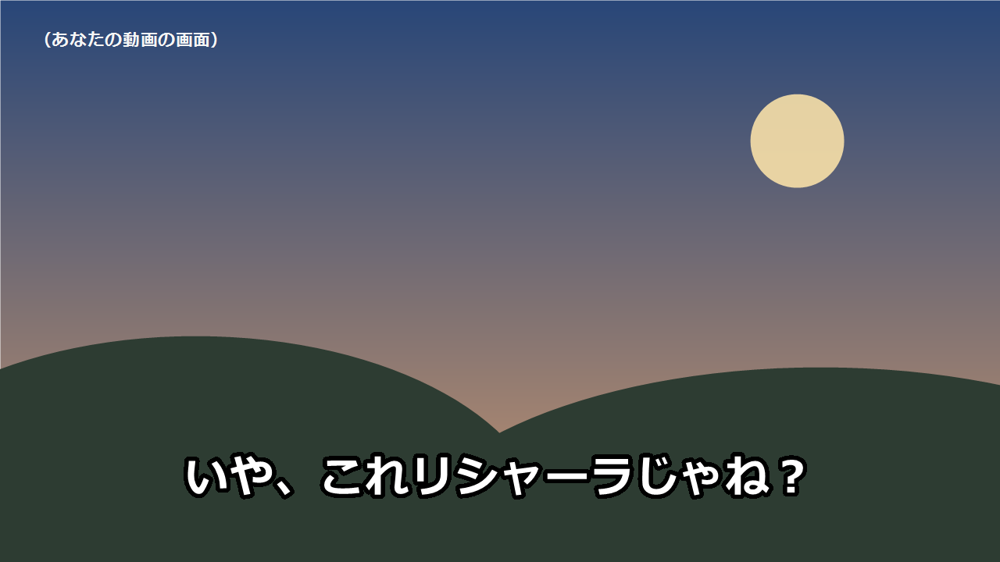

# テロップ自動生成（SubtitleApp）ベータ版

**動画をドラッグ＆ドロップして、待つだけ。日本語の字幕ができあがる Windows アプリです。**

配信の録画や切り抜き動画から、字幕（SRT ファイル）を自動で作ります。できた字幕はアプリの中で確認・修正でき、字幕を読み込めない編集ソフト向けに「テロップ動画」にすることもできます。
文字起こしは PC の中だけで行います。動画や音声をインターネットに送ることはありません。無料で使えます。

**[⬇ ダウンロード（0.2.0-beta.2）](https://github.com/oden06/SubtitleApp-releases/releases/tag/v0.2.0-beta.2)**　｜　[使い方のくわしい説明](#字幕を作る)　｜　[困ったとき](#うまくいかないとき)　｜　[不具合の報告](https://github.com/oden06/SubtitleApp-releases/issues)

---

## クイックスタート（3 ステップ）

**1. ダウンロードして起動する**
[ダウンロードのページ](https://github.com/oden06/SubtitleApp-releases/releases/tag/v0.2.0-beta.2)で `SubtitleApp-0.2.0-beta.2.exe` をクリックしてダウンロードし、ダブルクリックで起動します。**インストールは不要**です。
青い「Windows によって PC が保護されました」の画面が出たら、**「詳細情報」→「実行」** を押します（[くわしく](#windows-によって-pc-が保護されましたと出たとき)）。

**2. 動画をドラッグ＆ドロップする**
字幕を作りたい動画（または音声）のファイルを、アプリの点線の枠に持っていって離します。

**3. 待つ**
「✓ 完了」と出たら、元の動画と**同じフォルダー**に字幕ファイル（`.srt`）ができています。
初めてのときだけ、音声認識のデータ（約 550MB）をダウンロードするので時間がかかります。



これで字幕は完成です。字幕を直したいときや、テロップ動画を作りたいときは、下の「できること」を見てください。

---

## できること

### 1. 動画から日本語の字幕を作る
ドラッグ＆ドロップするだけで、話している言葉を字幕にします。OBS の録画（MP4、MKV など）もそのまま使えます。
ゲームの名前やキャラクター名は「固有名詞辞書」に登録しておくと、正しく出やすくなります（Escape from Tarkov の辞書が入っています）。

### 字幕の長さを選ぶ
メイン画面の「字幕の長さ」で、**短・中・長** から選べます。



- **短**（おすすめ・最初の設定）: 話した瞬間に字幕が出るので、テンポよく見られます。
- **中・長**: 短い文をまとめて表示するので、字幕の数が減ります。

字幕を作ったあとに変えても、文字起こしはやり直さないので、すぐに作り直せます（字幕ファイルは上書きされます）。

### 2. 字幕を確認・修正する
「字幕を確認・修正」を押すと、字幕が時間の順に並びます。
**▶ を押すと、その字幕のところの音声が流れる**ので、聞きながら直せます。字幕を消したいときは、文字を空にするだけです。



直した言葉は「辞書に追加」できます。次からは、同じ間違いを自動で直します（例: 「リシャラ」→「リシャーラ」）。

### 3. 字幕を「テロップ動画」にする（字幕ファイルを読み込めない編集ソフト向け）
Premiere Elements のように字幕ファイルを読み込めない編集ソフトでも、テロップを入れられます。
アプリが「緑の背景にテロップだけが映った動画」を作るので、それを動画の上に重ねて、緑を透明にします。

位置（9 か所 ＋ 細かい調整）、フォント、文字の大きさ、色、縁取り、影、背景の帯、行間などを選べます。緑の部分（プレビュー）をクリックすると、大きく表示できます。



編集ソフトで緑を透明にすると、このように動画の上にテロップがのります。



### そのほか
- 新しいバージョンや、辞書の新しい版が出たらお知らせします（設定でオフにできます）。
- 字幕を直した内容を、文字起こしの改善のために開発者へ送れます（最初はオフ。オンにした人だけ）。

> これはベータ版です。不具合や分かりにくい点があれば、[Issues](https://github.com/oden06/SubtitleApp-releases/issues) で教えてください。

---

## 必要なもの

- Windows 11（64 ビット）で動作を確認しています。Windows 10（64 ビット）でも動く見込みですが、まだ確認できていません。
- 空き容量: 約 1GB（アプリ本体、起動時に展開されるファイル、初回にダウンロードする音声認識のデータ）
- インターネット接続: 初めて文字起こしをするときだけ必要です（音声認識のデータ、約 550MB をダウンロードします）。2 回目からはなくても使えます。
- GPU（グラフィックボード）があると速くなります。なくても動きます。

---

## ダウンロードと起動（インストールは不要です）

1. [ダウンロードのページ](https://github.com/oden06/SubtitleApp-releases/releases/tag/v0.2.0-beta.2)を開きます（右側の「Releases」からも開けます）。
2. `SubtitleApp-0.2.0-beta.2.exe` をクリックしてダウンロードします。
3. ダウンロードした exe を、分かりやすい場所（例: デスクトップや「ドキュメント」の中に作ったフォルダー）に移します。
4. exe をダブルクリックして起動します。インストールの画面はありません。この exe だけで動きます。
   - 初めて起動するときは、必要なファイルを展開するため、ウィンドウが出るまで少し時間がかかります。

### 「Windows によって PC が保護されました」と出たとき

このアプリには、まだ「デジタル署名」がありません（費用がかかるため）。そのため、初めて起動するときに青い画面が出ることがあります。

1. 青い画面の **「詳細情報」** をクリックします。
2. 下に出る **「実行」** をクリックします。

次からは出ません。

- 「スマート アプリ コントロール」が有効な PC では、起動できません（Windows の設定で、署名のないアプリを止める機能です）。
- ウイルス対策ソフトが警告を出すことがあります。心配なときは、ダウンロードしたファイルが本物かどうかを、下の「ファイルの確認」で調べられます。

### ファイルの確認（任意）

Releases にある `.sha256` ファイルの中の文字列と、次のコマンドの結果が同じなら、ダウンロードしたファイルは本物です。

```powershell
Get-FileHash SubtitleApp-0.2.0-beta.2.exe -Algorithm SHA256
```

---

## はじめて起動したとき

2 つの質問が出ます。あとから「設定」でいつでも変えられます。

| 質問 | 最初の状態 | 内容 |
|---|---|---|
| 改善データの送信に協力する | **オフ** | 字幕を直したときの「直す前の文字 → 直した文字」を開発者に送ります（くわしくは下の「送信される情報」）。オンにした後の修正だけが送られます。 |
| 起動時に更新を確認する | **オン** | 1 日 1 回、新しいバージョンと、固有名詞辞書の新しい版があるかを確認します。何も送りません。更新は自動では行わず、お知らせを見て選べます。 |

---

## 字幕を作る

1. アプリの「文字起こし → SRT」の画面に、動画か音声のファイルをドラッグ＆ドロップします（または、点線の枠をクリックしてファイルを選びます）。
2. 進み具合のバーが動きます。終わるまで待ちます。
   - **初めてのときは、音声認識のデータ（約 550MB）をダウンロードするので時間がかかります。** 2 回目からは速くなります。
3. 「✓ 完了」と出たら、元の動画と**同じフォルダー**に、同じ名前の `.srt` ファイルができています。
   - 例: `配信の録画.mp4` → `配信の録画.srt`
   - 同じ名前のファイルがあるときは、上書きせずに `配信の録画 (2).srt` のように作ります。
4. 字幕の長さを変えたいときは、「字幕の長さ」で短・中・長を選びます。確認が出たら「OK」を押すと、作った字幕を新しい長さで作り直します。
   - 「字幕を確認・修正」で直した内容は消えます。直す前に長さを決めておくのがおすすめです。
   - テロップ動画を作っていた場合は、もう一度作成してください。

読み込めるもの: MP4、MKV、MOV、WAV、MP3、M4A など（Windows が再生できる形式）。OBS の録画もそのまま使えます。

### ゲームの名前や用語を正しく出したいとき（固有名詞辞書）

「固有名詞辞書」を開くと、ゲームを選んだり、言葉を登録したりできます。

- **ゲーム**: 遊んでいるゲームを選びます（最初は「Escape from Tarkov」が選ばれています）。一覧にないゲームは「新しいゲーム辞書…」で作れます。
- **追加する言葉**: キャラクター名や配信でよく使う言葉を入れて「追加」を押します。「、」で区切ると、まとめて入れられます。
- 登録した言葉は、選んだゲームのときだけ使われます。

---

## 字幕を確認・直す

1. 文字起こしが終わったら、「字幕を確認・修正」を押します。
2. 字幕が時間の順に並びます。
   - **▶** を押すと、その字幕のところの音声が流れます。もう一度押すと止まります。
   - 文字の欄をクリックして、直します。
   - 字幕を消したいときは、文字を全部消します（保存すると、その字幕はなくなります）。
3. **「保存して完了」** を押すと、`.srt` ファイルが直した内容で保存されます。

保存したあとに「辞書に追加しますか？」と出ることがあります。これは、直した言葉を次から自動で直すためのものです（例: 「リシャラ」→「リシャーラ」）。追加したいものにチェックを入れて「チェックした置換を追加」を押してください。ふだん使う言葉を置き換えると、ほかの場面まで変わってしまうので注意してください。追加した置換は「固有名詞辞書」から消せます。

---

## テロップ動画を作る（字幕ファイルを読み込めない編集ソフト向け）

字幕（SRT）を読み込めない編集ソフト（例: Premiere Elements）では、字幕を「テロップ動画」にして、動画の上に重ねて使います。

1. 「SRT → テロップ動画」の画面を開きます。
2. 動画のサイズ、フォント、文字の大きさ、色、位置などを選びます。
   - プレビュー（緑の部分）をクリックすると、大きく表示できます。
   - 「装飾」を開くと、縁取りの太さ、影、背景の帯、行間などを変えられます。
   - 選んだ内容は、次に起動したときも残ります。
3. `.srt` ファイルをドラッグ＆ドロップします。
4. 同じフォルダーに `〇〇_telop.mp4` ができます。

### 編集ソフトでの使い方

1. 元の動画を置いたトラックの**上のトラック**に、`_telop.mp4` を **0:00 の位置** から置きます。
2. 緑の色を透明にする効果（「クロマキー」「Videomerge」など）をかけます。

- 緑に近い色の文字や帯は、背景と一緒に透明になってしまいます（アプリが注意を出します）。
- 背景の帯は不透明だけです（半透明にはできません）。
- Premiere Elements での表示は、まだ十分に確認できていません。うまく抜けないときは Issues で教えてください。

---

## 更新

新しいバージョンや辞書の新しい版が出ると、起動したときにお知らせが出ます。

- **アプリ**: 「リリースのページを開く」から新しい exe をダウンロードして、古い exe と入れ替えてください。辞書や設定はそのまま引き継がれます。
- **辞書**: 「更新する」を押すと入れ替わります。あなたが追加した言葉は残ります。
- 「設定」の **「今すぐ確認」** で、いつでも確認できます。

---

## 送信される情報

このアプリがインターネットに接続するのは、次の 3 つだけです。

| いつ | 何をするか | 送るもの |
|---|---|---|
| 初めての文字起こし | 音声認識のデータをダウンロード | なし |
| 起動時（1 日 1 回、オフにできる） | 新しいバージョンと辞書の確認 | なし |
| 字幕を直して保存したとき（**オンにした場合だけ**） | 改善データの送信 | 下の表 |

改善データで送るもの・送らないもの:

| 送るもの | 送らないもの |
|---|---|
| 直す前の文字と、直した文字 | 動画、音声 |
| 使ったゲーム辞書と、ゲームの識別情報 | ファイル名、フォルダーの場所 |
| アプリのバージョン、音声認識のデータの名前 | 直していない前後の字幕 |
| インストールごとにランダムに作った番号（同じ PC からの重複を見分けるためだけ） | Windows のユーザー名、PC の名前 |

アカウント情報は付けずに送ります。通信の仕組み上、IP アドレスは送信先（Cloudflare）に届きますが、収集したデータとしては保存しません。

---

## データの保存場所とアプリの削除

- アプリが使うデータ（辞書、設定、修正の履歴、音声認識のデータ）は、次のフォルダーに保存されます。字幕の長さを変えるために、文字起こしの結果も一時的に保存しますが、アプリを終了すると消えます。
  `%LOCALAPPDATA%\SubtitleApp`
  （エクスプローラーのアドレス欄にこの文字を貼り付けると開けます）
- 起動時に展開されるファイルは `%TEMP%\.net\SubtitleApp-（バージョン）` にあります（約 200MB。Windows の一時ファイルの掃除で消えても、次の起動で自動的に作り直されます）。
- アプリを削除するときは、exe と、上の 2 つのフォルダーを消してください。

---

## うまくいかないとき

| こんなとき | ためしてほしいこと |
|---|---|
| 起動しない | 上の「Windows によって PC が保護されました」を見てください。スマート アプリ コントロールが有効な PC では起動できません。 |
| 初めての文字起こしが進まない | 音声認識のデータ（約 550MB）をダウンロードしています。インターネットにつながっているか確認して、しばらく待ってください。 |
| 「このファイルは開けません」と出る | Windows で再生できない形式の可能性があります（例: Ogg Vorbis）。MP4 や WAV に変換してから試してください。 |
| 固有名詞が違う文字になる | 「固有名詞辞書」で正しいゲームを選び、言葉を登録してください。字幕を直して「辞書に追加」すると、次から自動で直ります。 |
| 字幕の出るタイミングが少しずれる | 同じ言葉を連続で言ったとき（例: 「ジョン！ジョン！」）などは、ずれることがあります。 |
| テロップの折り返しが変な位置になる | 「装飾」の「1 行の幅」を広げてください。 |

---

## 既知の制限（ベータ版）

- デジタル署名がありません（上の「起動」を参照）。
- 長い録画（1 時間を超えるもの）は、まだ十分に確認できていません。
- Premiere Elements など、編集ソフトでのテロップ動画の表示は、まだ十分に確認できていません。
- 字幕やテロップは言葉の切れ目で区切るようにしていますが、とても長い言葉や、聞き取りにくい部分では、言葉の途中で区切れることがあります。

---

## 不具合の報告・要望

[Issues](https://github.com/oden06/SubtitleApp-releases/issues) から送ってください。次の情報があると助かります。

- アプリのバージョン（ウィンドウの上に表示されています）
- どんな操作をしたか、何が起きたか
- Windows のバージョン

Issues の内容は誰でも見られます。個人情報や、公開したくない動画・音声は貼らないでください。

---

## 支援

開発を応援していただける方は、[Ko-fi](https://ko-fi.com/oden06) からお願いします。

## 利用条件

- このアプリは無料で利用できます（個人・商用を問いません）。アプリで作った字幕やテロップ動画は、自由に使えます。
- アプリ自体の再配布、改変、逆コンパイルなどの解析は禁止します。
- このアプリは現状のまま提供されます。利用によって生じた損害について、作者は責任を負いません。

アプリが使っているソフトウェアのライセンスは、アプリの右下の「ライセンス」から確認できます。
